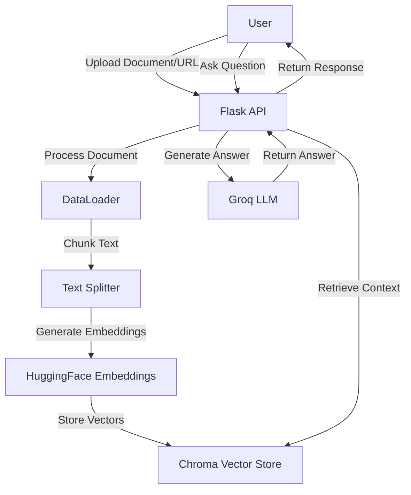

# AI-Powered Document Q&A System

This project implements an AI-powered document question-answering system using LangChain, Groq, and various document processing techniques. It allows users to upload documents or provide URLs, process the content, and ask questions about the information contained within.

## Table of Contents

- [Features](#features)
- [System Architecture](#system-architecture)
- [Setup](#setup)
- [Usage](#usage)
- [API Endpoints](#api-endpoints)
- [Contributing](#contributing)
- [License](#license)

## Features

- Document upload and processing (PDF, TXT, MD, HTML, JSON, CSV, XLSX)
- Web page crawling and content extraction
- Text chunking and embedding
- Vector store for efficient similarity search
- AI-powered question answering using Groq's LLM
- History-aware retrieval for context-sensitive responses
- Flask-based API for easy integration

## System Architecture

Here's a high-level overview of the system architecture:



## Setup

1. Clone the repository:
   ```
   git clone https://github.com/your-username/ai-document-qa.git
   cd ai-document-qa
   ```

2. Create a virtual environment and activate it:
   ```
   python -m venv venv
   source venv/bin/activate  # On Windows, use `venv\Scripts\activate`
   ```

3. Install the required dependencies:
   ```
   pip install -r requirements.txt
   ```

4. Set up environment variables:
   Create a `.env` file in the project root and add the following:
   ```
   GROQ_API_KEY=your_groq_api_key_here
   USER_AGENT=your_user_agent_string_here
   ```

5. Create necessary directories:
   ```
   mkdir db document_storage
   ```

## Usage

To start the server, run:

```
python app.py
```

The server will start on `http://localhost:8080`.

## API Endpoints

### 1. Chat with AI

- **Endpoint**: `/chat`
- **Method**: POST
- **Payload**:
  ```json
  {
    "query": "Your question here"
  }
  ```
- **Response**:
  ```json
  {
    "answer": "AI-generated answer"
  }
  ```

### 2. Ask Questions from Documents

- **Endpoint**: `/ask_from_doc`
- **Method**: POST
- **Payload**:
  ```json
  {
    "query": "Your question about the documents"
  }
  ```
- **Response**:
  ```json
  {
    "answer": "AI-generated answer based on documents",
    "sources": [
      {
        "source": "document_name.pdf",
        "page_content": "Relevant excerpt from the document"
      }
    ]
  }
  ```

### 3. Add Document

- **Endpoint**: `/add_document`
- **Method**: POST
- **Payload**: Form-data with file upload
- **Response**:
  ```json
  {
    "Status": "Successfully uploaded",
    "filename": "uploaded_file.pdf",
    "chunks": 42
  }
  ```

### 4. Add URL

- **Endpoint**: `/add_url`
- **Method**: POST
- **Payload**:
  ```json
  {
    "url": "https://example.com/page-to-process"
  }
  ```
- **Response**:
  ```json
  {
    "status": "Successfully processed",
    "url": "https://example.com/page-to-process",
    "chunks": 15
  }
  ```

## Contributing

Contributions are welcome! Please feel free to submit a Pull Request.

## License

This project is licensed under the MIT License.
